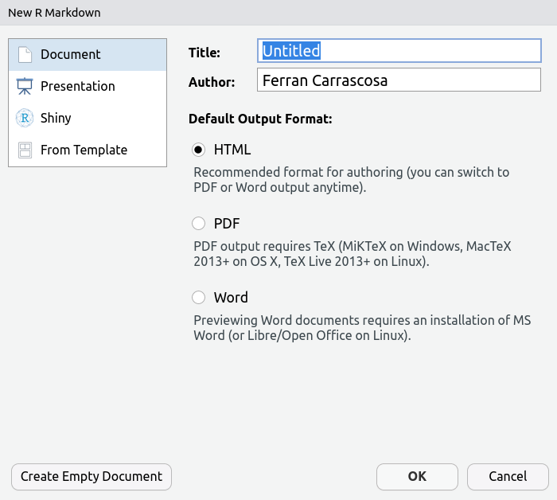

# (PART) Computació en R {-}

```{r child = '_header.Rmd'}
```

# Posta a punt {#postapunt}

## R

R és [GNU](https://www.gnu.org/) i per tant Programari lliure). És un entorn i llenguatge per a als gràfics i la computació estadística.

Si bien R funciona perfectamente des de consola de texto (R-GUI en windows o bien, ejecutando comando R desde xterm en Linux) en el curso se utilizará la interfaz gráfica de RStudio.  Ejecuta la siguiente línea.

```{r}
6 / (4 - 1)
```

> Puedes recuperar las líneas ejecutadas previamente apretando la tecla Arriba del cursor.

Pots instalar R tant en Linux, Mac com e Windows des de: https://cran.r-project.org/ .

Para pedir ayuda sobre una función hay 2 opciones:
 
1. Con un ?

```{r, eval = FALSE}
?read.table
```

1. Con dos ?

```{r, eval = FALSE}
??excel
```

## RStudio

El lenguaje R se puede escribir mediante editor de texto en ficheros con extensión `*.R`. El entorno RStudio (ver imagen), incorpora, además de un editor y de la consola de R, un conjunto de utilidades que facilitan las tareas de programación y análisis de datos: navegador de ficheros, ayuda, objetos en memoria, visor de gráficos...

```{r bas-rstudio, fig.align='center',echo=FALSE, out.width='750px', fig.cap="Entorno RStudio (Fuente: Elaboración propia)."}

```

Per programar en R utilitzarem el IDE RStudio. Un cop hagis instal·lat R, pots instalar RStudio des de:  https://rstudio.com/products/rstudio/download/#download .

Las combinaciones de teclas disponibles: `Alt + Shift + K`

- Ejecutar código: `Ctrl + Enter`
- Ir a la ventana de código: `Ctrl + 1`
- Ir a la consola: `Ctrl + 2`

### Crear un proyecto {#gitproject}

Opcionalmente, resulta útil crear un proyecto en RSTudio descargando el material y datos de este curso, des de la plataforma GitHub (compartir código y datos).

Los pasos son los sigientes:

- File > New Project...
- Versión Control > Git
- Repository URL:
   - https://github.com/griu/meacp.git

```{r bas-git, fig.align='center',echo=FALSE, out.width='500px', fig.cap="Crear proyecto Git del Curso (Fuente: Elaboración propia)."}

```

Alternativamente, puedes descargar el material des del navegador y crear un proyecto de RSTudio:

- Descargar el material des del enlace:
   - https://github.com/griu/meacp
   - "Code" -> "Download Zip"
- Descomprimir el código
- Crear el proyecto des de R
   - File -> New Project ... -> New Directory -> New project
   - Buscar la carpeta con el código descomprimido

## Paquets de R {#paquetes}

Hi ha tota una comunitat de desenvolupadors que amplien les funcionalitats de R a través de llibreries o paquets. Per utilizar auquests funcionalitats, primer es necesari instalar els paquets. 

Se publican en [CRAN](https://cran.r-project.org/), un repositorio centralizado. Actualmente contiene más de 16 mil paquetes. 

Los más importantes, como `stats`, `graphics`, `methods`, `base...` están ya disponibles en la consola. 

Otros, por ejemplo `foreign` (leer datos de fuentes externas), vienen instalados, pero es necesario cargarlos con `library(foreign)` al abrir la sesión. 

Otros, la mayoría, es necesario instalarlos antes con `install.packages("nombre_paquete")`.

A continuació, fes la instal·lació dels següents paquetes, executant, d'una en una, cadascuna  de les següent comandes des de la consola de R o RStudio:

```
install.packages("pander")
install.packages("kableExtra")
install.packages("tidyverse")
install.packages("ggrepel")
install.packages("ggcorrplot")
install.packages('rmarkdown')
install.packages("DT")
install.packages("plotly")
install.packages("cowplot")
install.packages("car")
install.packages("corrplot")
install.packages("FactoMineR")
install.packages("factoextra")
install.packages("quantreg")
install.packages("psych")
install.packages("mice")
install.packages("cluster")
install.packages("readxl")
install.packages("remotes")
install.packages("WDI")
install.packages("gapminder")
install.packages("datos")
install.packages("HistData")
install.packages("poliscidata")
```

## Rmarkdown (*.Rmd) 

Puedes generar de forma dinámica documentos PDF, Word (como éste que estás leyendo) o HTML mediante ficheros de tipo Rmarkdown (*.Rmd). Este formato, permite combinar texto con formato, código R y resultados (tablas y gráfcos) ejecutados por R.

> Puedes acceder al materialdel curso en formato Bookdown (un tipo de RMarkdown) en [Github.](https://github.com/griu/meacp).

### Comandos Rmarkdown {-}

- **R chunks**: \`\`\`{r, options} CODIGO R \`\`\`: echo, eval, fig.cap, warning, message. Opciones:
   - `include = FALSE` : Ejecuta pero no muestra el código ni resultados.
   - `echo = FALSE` : No muestra el código, pero sí el resultado (tablas, gráficos...).
   - `fig.cap = "..."` : Añade un texto al pie de imagen.
- **R inline**: \` r CODIGO R\`
- **Titulo**: \# TITULO1,  \#\# TITULO2
- **Emphasis**: Negrita con `**string**` . Cursiva con `*string*`
- **Link externo**: `[texto enlace](http://url)`
- **Imagen**: ``
- **Lista de puntos**: Al inicio de línea, usa guion `-`
- **Lista numerada**: Al inicio, pon `1.`
- **Código látex**:  ```$x^2$```. Salida: $x^2$
- **Línea en blanco**: Una linea nueva con `<br>`
- **Sangrado (Indented)**: Al incio de línea, usa símbolo `> `
- **Tablas**: `kintr::kable(tabla)`

Puedes ver la [hoja resumen](https://rstudio.com/resources/cheatsheets/) y la [Guía completa](https://bookdown.org/yihui/rmarkdown/). 

### Recomendaciones {-}

### Recomendaciones {-}

-	Enriquece los informes con elmentos RMarkdown: Listas, cursiva...
- Combina código y texto con: inline R.
- Configura las Tablas de contenidos.
- Utiliza caption en tablas y gráficos.
-	Muestra sólo el código indispensable.
-	Los Gráficos con título (global y ejes) y leyenda.

##### Actividad guiada 1.1 {-}

Genera tu primer documento RMarkdown. En RStudio, accede al menú `File > New File > R Markdown > Documentos > html` y edita `Title`y `Author` del formulario de la imagen y el formato de salida HTML > aprieta `OK`.

```{r bas-rmarkdown, fig.align='center',echo=FALSE, out.width='500px', fig.cap="Menú de nuevo RMarkdown (Fuente: Elaboración propia)."}

```

Guarda el documento generado automáticamente con el nombre `11_actividad.Rmd`. Ahora genera el documento apretando el botón **Knit**.

Puedes ver la solución en \@ref(act11) .

## Actividad guiada 1.1 {#act11}

```
---
title: "Actividad 1.1."
author: "FC"
date: "8/15/2020"
output: html_document
---
```

### R Markdown

This is an R Markdown document. Markdown is a simple formatting syntax for authoring HTML, PDF, and MS Word documents. For more details on using R Markdown see <http://rmarkdown.rstudio.com>.

When you click the **Knit** button a document will be generated that includes both content as well as the output of any embedded R code chunks within the document. You can embed an R code chunk like this:

```{r cars}
# Utiliza el comando summary para mostrar un resumen general de cars
summary(cars)
```

### Including Plots

You can also embed plots, for example:

```{r pressure, echo=FALSE}
# Utiliza el comando plot para visualizar pressure en un gráfico
plot(pressure)
```

Note that the `echo = FALSE` parameter was added to the code chunk to prevent printing of the R code that generated the plot.
